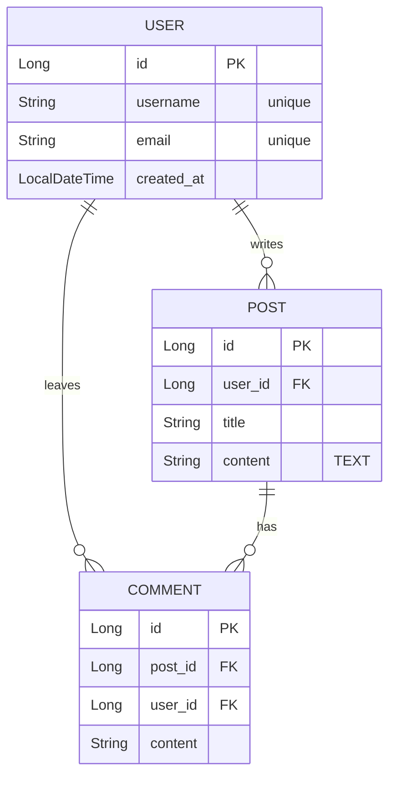

# Database ERD Design with Mermaid

물리적 데이터베이스 스키마를 설계하고 유효한 Mermaid ER 다이어그램 문법을 생성합니다.

## Overview

- 사용자의 요구사항, 도메인 개념 또는 기존 코드를 구조화된 ERD(Entity-Relationship Diagram)로 변환할 때 사용합니다.
- 마크다운 뷰어에서 미리 보거나 JPA 엔티티 및 SQL 스키마 구현을 위한 청사진으로 사용할 수 있는 표준 Mermaid `erDiagram` 문법을 출력합니다.
- 가독성을 높이기 위해 다이어그램 생성 후 간단한 데이터 사전(Data Dictionary) 설명을 함께 제공합니다.

## When to Use This Skill

- 새로운 프로젝트나 기능을 시작할 때 데이터베이스 구조를 시각화해야 하는 경우
- 다양한 도메인 모델 간의 관계(1:1, 1:N, N:M)를 정의하고 매핑해야 하는 경우
- 프로젝트 문서화를 위해 `docs/erd.md` 파일을 생성하는 경우

## How It Works

### Step 1: [엔티티 분석 및 식별]
제공된 도메인 요구사항을 분석하여 핵심 엔티티와 필수 속성을 식별합니다.
- **일관된 데이터 타입**을 결정합니다 (예: `VARCHAR`, `INT`, `TIMESTAMP` 같은 표준 SQL 타입이나 `Long`, `String` 같은 Java 프레임워크 타입 중 하나로 통일).
- 각 속성에 대한 제약 조건(예: `"unique"`, `"not null"`)을 정의합니다.

### Step 2: [키 및 관계 정의]
각 엔티티의 기본 키(`PK`)를 식별합니다. 관계를 설정하는 데 필요한 외래 키(`FK`)를 결정합니다. 엔티티 간의 카디널리티(기수성)를 신중하게 평가합니다.
- 1대1 (1:1): `||--||` 또는 `|o--o|`
- 1대다 (1:N): `||--o{`
- 다대다 (N:M): 두 개의 1:N 관계로 해소하기 위해 **반드시 매핑/조인 테이블(Mapping/Join Table)을 도입**합니다.

### Step 3: [Mermaid 구문 및 데이터 사전 생성]
엄격하게 유효한 Mermaid 문법을 사용하여 ERD를 생성하고, 그 뒤에 간단한 설명을 덧붙입니다.
- 코드 블록은 항상 ` ```mermaid ` 와 `erDiagram`으로 시작합니다.
- 관계(Relationships) 정의는 다이어그램 블록 최상단에 배치하고 짧고 명확한 라벨(예: `"owns"`, `"contains"`)을 추가합니다.
- 엔티티 블록은 관계 정의 아래에 작성합니다. **가장 중요한 점은, 관계선에만 의존하지 말고 자식 엔티티의 속성 블록 내부에 `FK` 컬럼을 명시적으로 작성하는 것입니다.**
- **데이터 사전 (Data Dictionary):** Mermaid 블록이 끝난 후, 각 테이블의 역할과 핵심 제약조건을 읽기 쉬운 표준 마크다운 목록 형태로 간략히 정리하여 출력합니다.

## Examples



### Data Dictionary

* **USER:** 사용자 계정 정보를 저장합니다. `username`과 `email`은 고유(unique)해야 합니다.
* **POST:** 사용자가 작성한 게시글을 나타냅니다. 작성자를 식별하기 위해 `user_id`를 FK로 포함합니다.
* **COMMENT:** 게시글에 남겨진 댓글을 나타냅니다. 어떤 게시글에 누가 작성했는지 식별하기 위해 `post_id`와 `user_id` 모두 FK로 포함합니다.

## Best Practices

* **N:M 관계 해소:** 관계형 데이터베이스는 N:M 관계를 직접 구현할 수 없습니다. Mermaid의 N:M 구문(`}o--o{`)을 사용하는 대신, 실제 DB 테이블과 일치하도록 명시적인 매핑/조인 엔티티(예: `POST_TAG`)를 항상 생성하십시오.
* **컨텍스트 제공:** 개발자가 목적이나 제약 조건을 쉽게 이해할 수 있도록 복잡한 컬럼 옆에는 짧은 주석이나 문자열 설명을 추가하십시오.

## Common Pitfalls

* **문법 오류:** Mermaid 블록 내의 엔티티 이름에는 공백이 없어야 합니다(`CamelCase` 또는 `snake_case` 사용). 문법이 잘못되면 다이어그램이 렌더링되지 않습니다.
* **외래 키(FK) 누락:** 자식 엔티티의 속성 블록 내에 FK 컬럼을 명시적으로 나열하는 것을 잊지 마십시오. 단순히 관계 선을 그리는 것만으로는 완전한 스키마 설계라고 할 수 없습니다.

## Related Skills

* `spring-jpa-entity-design`: 생성된 ERD를 바탕으로 실제 Spring Boot JPA 엔티티 코드로 변환할 때 이 스킬을 연계하여 사용하십시오.
