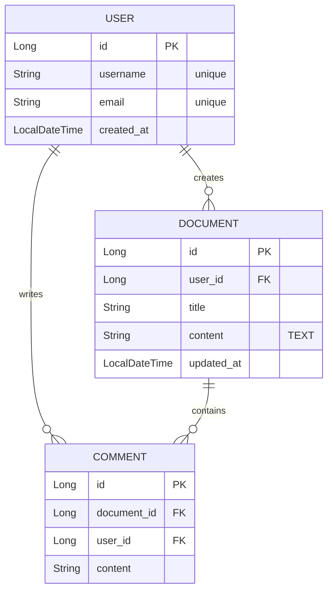

# Mermaid를 활용한 데이터베이스 ERD 설계

물리적 데이터베이스 스키마를 설계하고 유효한 Mermaid ER 다이어그램 문법을 생성합니다.

## Overview

- 사용자의 요구사항, 도메인 개념 또는 기존 코드를 구조화된 ERD(Entity-Relationship Diagram)로 변환할 때 사용합니다.
- 마크다운 뷰어에서 미리 볼 수 있고 JPA 엔티티나 SQL 스키마 구현을 위한 청사진으로 사용할 수 있는 표준 Mermaid `erDiagram` 문법을 출력합니다.
- 다이어그램의 가독성을 높이기 위해 하단에 짧은 데이터 사전(Data Dictionary) 설명을 한국어로 포함합니다.

## When to Use This Skill

- 새로운 프로젝트나 기능을 시작할 때 데이터베이스 구조를 시각화해야 하는 경우.
- 다양한 도메인 모델 간의 관계(1:1, 1:N, N:M)를 매핑해야 하는 경우.
- 프로젝트 문서화를 위해 `docs/erd.md` 파일을 생성할 때.

## How It Works

### Step 1: 엔티티 분석 및 식별

제공된 도메인 요구사항을 분석하여 핵심 엔티티와 필요한 속성을 식별합니다.
- 적절하고 **엄격하게 일관된 데이터 타입**을 결정합니다. 표준 SQL 타입이나 대상 프레임워크 타입(예: `BIGINT` 대신 Java의 `Long`)을 고려하세요.
- 각 속성에 대한 제약 조건(예: `"unique"`, `"not null"`)을 정의합니다.

### Step 2: 키 및 관계 정의

각 엔티티의 기본 키(`PK`)를 식별합니다. 관계를 설정하는 데 필요한 외래 키(`FK`)를 결정합니다. 엔티티 간의 카디널리티(기수성)와 모달리티를 주의 깊게 평가하세요:
- 1대1 (1:1): `||--||` 또는 `|o--o|`
- 1대다 (1:N): `||--o{`
- 다대다 (N:M): 두 개의 1:N 관계로 풀어내기 위해 매핑/조인 테이블(엔티티)을 명시적으로 도입하세요.

### Step 3: Mermaid 문법 및 데이터 사전 생성

엄격하게 유효한 Mermaid 문법을 사용하여 ERD를 생성하고, 그 뒤에 간단한 설명을 덧붙입니다.
- 항상 ` ```mermaid ` 와 `erDiagram`으로 코드 블록을 시작하세요.
- 관계선은 다이어그램 블록 상단에 배치하고, 짧고 설명적인 라벨(예: `"owns"`, `"contains"`)을 붙이세요.
- 관계 아래에 엔티티 블록을 정의하세요. **결정적으로, 자식 엔티티의 속성 블록 안에 `FK` 컬럼을 명시적으로 작성해야 합니다.** 단순히 관계선에만 의존하지 마세요.
- **데이터 사전(Data Dictionary):** Mermaid 블록 다음에는 `### Data Dictionary` 제목 아래에 테이블과 핵심 역할/제약 조건을 한국어로 간단히 나열하세요. 가능한 경우 예상되는 Java 타입 매핑을 명시하세요.

## Examples


```mermaid
erDiagram
    USER ||--o{ DOCUMENT : "creates"
    USER ||--o{ COMMENT : "writes"
    DOCUMENT ||--o{ COMMENT : "contains"

    USER {
        Long id PK
        String username "unique"
        String email "unique"
        LocalDateTime created_at
    }

    DOCUMENT {
        Long id PK
        Long user_id FK
        String title
        String content "TEXT"
        LocalDateTime updated_at
    }

    COMMENT {
        Long id PK
        Long document_id FK
        Long user_id FK
        String content
    }

```

### Data Dictionary

* **USER:** 사용자 계정 정보를 저장합니다. `username`과 `email`은 고유값(Unique)이어야 합니다.
* **DOCUMENT:** 사용자가 작성한 마크다운 문서입니다. 작성자를 식별하기 위해 `user_id`를 외래키(FK)로 가집니다.
* **COMMENT:** 문서에 남겨진 댓글입니다. 어떤 문서의 댓글인지(`document_id`), 누가 작성했는지(`user_id`)를 모두 외래키로 가집니다.

## Best Practices

* **N:M 관계 해소:** 관계형 데이터베이스는 N:M 관계를 직접 구현할 수 없습니다. Mermaid의 N:M 문법(`}o--o{`)을 사용하는 대신 명시적인 매핑/조인 엔티티를 생성하여 실제 데이터베이스 테이블을 직접 반영하세요.
* **컨텍스트 제공:** 복잡한 컬럼 옆에 짧은 주석이나 문자열 설명을 추가하여 개발자에게 목적이나 제약 조건을 설명하세요.

## Common Pitfalls

* **문법 오류:** Mermaid 블록 내의 엔티티 이름에 공백이 없도록 하세요 (`CamelCase` 또는 `snake_case` 사용).
* **따옴표 누락:** Mermaid 블록 안에서 컬럼 제약 조건이나 주석은 항상 큰따옴표로 묶으세요(예: `"unique"`, `"TEXT"`). 그렇게 하지 않으면 렌더링 오류가 발생합니다.
* **엔티티 내 빈 줄:** Mermaid의 엔티티 속성 블록 `{ }` 안에 빈 줄을 남기지 마세요. 일부 마크다운 파서에서 렌더링 오류를 일으킵니다.
* **외래 키 누락:** 자식 엔티티의 속성 블록 안에 FK 컬럼을 명시적으로 나열하는 것을 잊지 마세요.

## Related Skills

* `spring-jpa-entity-design`: 생성된 ERD를 실제 Spring Boot JPA 엔티티 코드로 변환할 때 이 스킬을 이어서 사용하세요.
