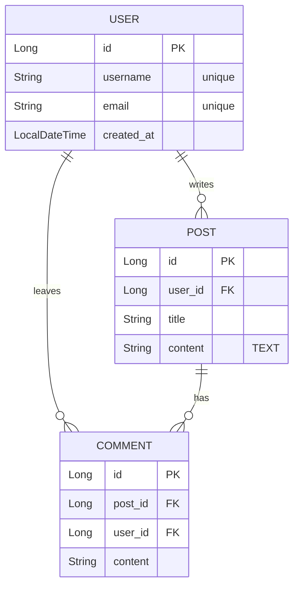

# Database ERD Design with Mermaid

Design physical database schemas and generate valid Mermaid ER diagram syntax.

## Overview

- Use to translate user requirements, domain concepts, or existing code into a structured Entity-Relationship Diagram (ERD).
- Outputs standard Mermaid `erDiagram` syntax, which can be previewed in Markdown viewers and used as a blueprint for implementing JPA entities or SQL schemas.
- Includes a brief Data Dictionary explanation after the diagram for better readability.

## When to Use This Skill

- When starting a new project or feature and needing to visualize the database structure.
- When asked to map out relationships (1:1, 1:N, N:M) between various domain models.
- When generating a `docs/erd.md` file for project documentation.

## How It Works

### Step 1: [Analyze and Identify Entities]
Analyze the provided domain requirements. Identify the core entities and their necessary attributes. 
- Determine appropriate and **strictly consistent data types** (e.g., standard SQL types like `VARCHAR`, `INT`, `TIMESTAMP`, or target framework types like Java's `Long`, `String`).
- Define constraints (e.g., `"unique"`, `"not null"`) for each attribute.

### Step 2: [Define Keys and Relationships]
Identify the Primary Key (`PK`) for each entity. Determine the Foreign Keys (`FK`) needed to establish relationships. Carefully evaluate the cardinality and modality between entities:
- One-to-One (1:1): `||--||` or `|o--o|`
- One-to-Many (1:N): `||--o{`
- Many-to-Many (N:M): Introduce a mapping/join table to resolve into two 1:N relationships.

### Step 3: [Generate Mermaid Syntax & Data Dictionary]
Generate the ERD using strictly valid Mermaid syntax, followed by a brief explanation.
- Always start the code block with ` ```mermaid ` and `erDiagram`.
- Place relationships at the top of the diagram block with brief, descriptive labels (e.g., `"owns"`, `"contains"`).
- Define entity blocks below the relationships. **Crucially, explicitly write out the `FK` columns inside the child entity's attribute block**; do not rely solely on the relationship line.
- **Data Dictionary:** After the Mermaid block, briefly list the tables and their core roles/constraints in standard Markdown text **under a `### Data Dictionary` heading** for easy reading.

## Examples



### Data Dictionary

* **USER:** Stores user account information. `username` and `email` must be unique.
* **POST:** Represents an article written by a user. Contains `user_id` as an FK.
* **COMMENT:** Represents a comment left on a post. Contains both `post_id` and `user_id` as FKs.

## Best Practices

* **Resolve N:M Relationships:** Relational databases cannot directly implement N:M relationships. Always create an explicit mapping/join entity (e.g., `POST_TAG`) instead of using Mermaid's N:M syntax (`}o--o{`), to directly mirror actual database tables.
* **Provide Context:** Add brief comments or string descriptions next to complex columns to explain their purpose or constraints to the developer.

## Common Pitfalls

* **Syntax Errors:** Ensure no spaces exist in entity names within the Mermaid block (use `CamelCase` or `snake_case`). Invalid syntax will prevent the diagram from rendering.
* **Unquoted Constraints:** Always enclose column constraints or comments in double quotes inside the Mermaid block (e.g., `"unique"`, `"TEXT"`). Failing to do so causes rendering errors.
* **Missing Foreign Keys:** Do not forget to explicitly list the FK columns inside the child entity's attribute block; simply drawing the relationship line is not enough for a complete schema design.

## Related Skills

* `spring-jpa-entity-design`: Use this skill next to convert the generated ERD into actual Spring Boot JPA entity code.
